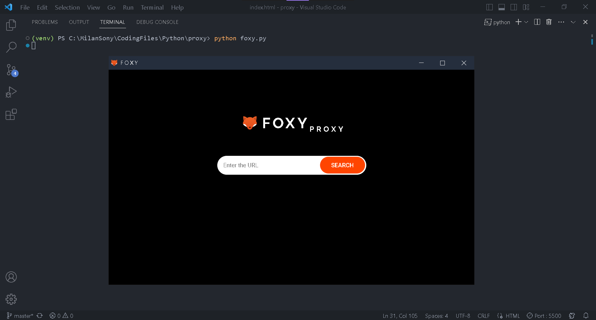

<p align="center">
    
</p>

<h1 align="center">
  FOXY<sub>PROXY</sub>
</h1>

<p align="center">A proxy server build with selenium webdriver for chrome in python</p>

## 💭 BTS

<details>
  <summary>Click Here</summary>
I recently saw an article on <a href="https://medium.com/">Medium</a> about how to make a proxy server of our own. After reading the <a href="https://thesocialproxy.medium.com/making-a-proxy-server-in-selenium-the-ultimate-guide-ee8b8a09f222">article</a> I got a basic idea of how to build one. First I tought to build it by scrapping all the free proxies available and also apply the concept of rotating proxies then pass it to the selenium webdriver. Trust me! most of the free proxies availabe out there are not working and most of them won't works with google too. Scrapping all the proxies available then getting the working one was very time consuming. So I search whether there is any libray for getting free proxies. After some searches I found one named <a href="https://pypi.org/project/free-proxy/">free-proxy</a> I added this library to my code, it gave working proxies and the library also has many parameters, this helps me to find proxies that works with google. Then I created custom options for the Selenium webdriver for chrome and pass the proxy to it, then solved the problems faced by the web driver like stoping the chrome from automatically closin, remote allow origins, accept insecure certificates etc. With Eel-python library I build a UI to enter the URL to search.

There are many websites out there that provies free proxies like <a href="https://www.croxyproxy.com/">croxyproxy</a>, but I just wanted to bulid one for myself :)
</details>

## Libraries used

- `free_proxy`
- `selenium`
- `Eel`

## Read documentation about

- <a href = "https://pypi.org/project/free-proxy/">free-proxy</a>
- <a href = "https://selenium-python.readthedocs.io/">selenium</a>
- <a href = "https://pypi.org/project/Eel/">Eel</a>

## Run locally

You will need to install Python on you system, head over to https://www.python.org/downloads/ to download python.
(Dont Forget to tick `Add Python to PATH` while installing Python)

Once you have downloaded Python on your system, 
run the following command inside your terminal (only if your system is git enabled, otherwise download the zip file and extract it)

```bash
  git clone https://github.com/milan-sony/foxy.git
```

Then go to the project folder

```bash
  cd foxy
```

(This is optional, but strongly recommended) Make a virtual environment

```bash
  python -m venv venv
```

Activate the virtual environment

```bash
  venv/Scripts/activate
```

If error occurs when activating virtual environment, run the following command

```bash
  Set-ExecutionPolicy -Scope CurrentUser -ExecutionPolicy Unrestricted
```

Then Install the dependencies needed for this project

```bash
  pip install -r requirements.txt
```

Now run the script

```bash
  python foxy.py
```

## Working

First it will the get the URL to search from the user through UI. This URL is passed into the main function and then the selenium browser will open this URL with proxy server and custom user agent in seperate chrome window.

> The proxy server that we get will most probabily a Japanese server. So there might be some language translate issue inside the website

## Note

Please enter a valid URL with full address

❌ google

✔️ https://www.google.com

## Keep in mind

A VPN and proxy server both mask your IP address. But a VPN will also encrypt the data you send and receive, something that a proxy server doesn't do.

## Screenshot


